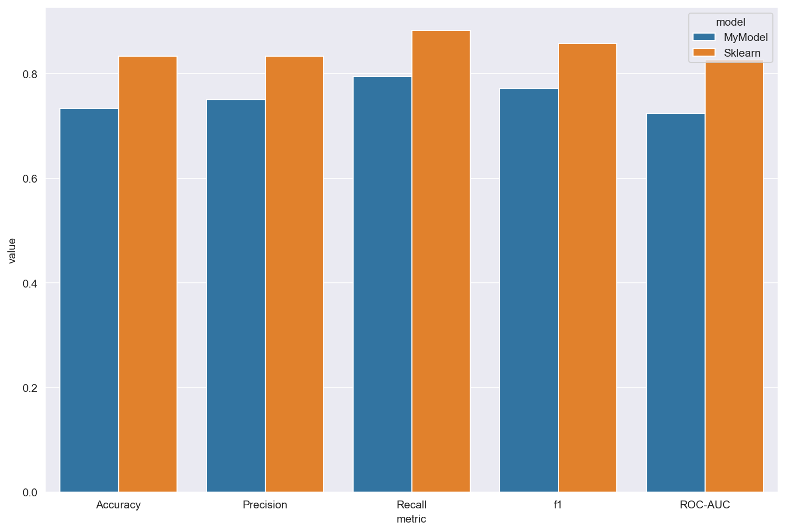
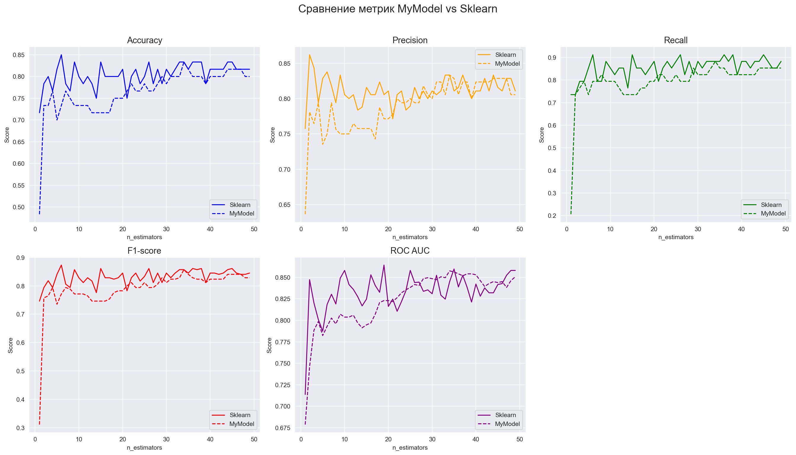
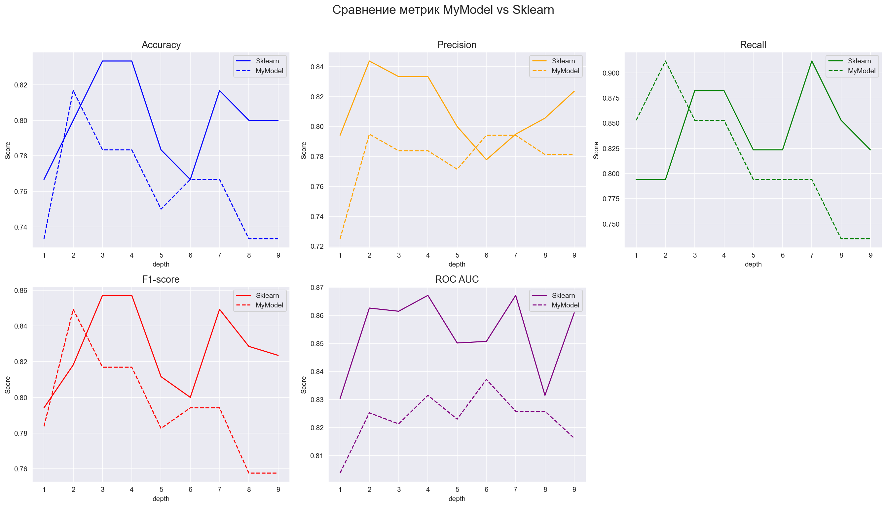
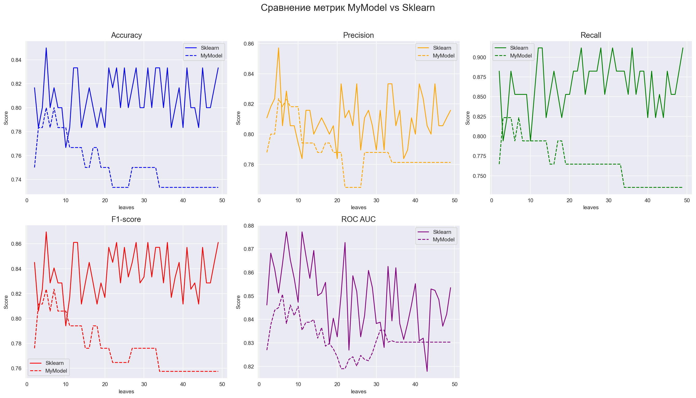
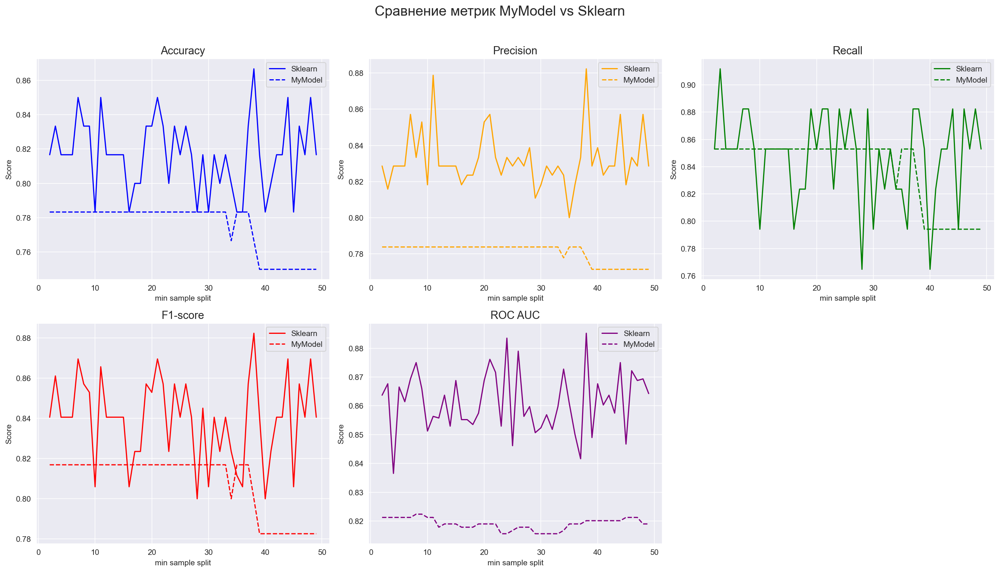

# Проект: Реализация случайного леса для классификации с нуля (MyForestClf)

## Введение

Проект реализует **ансамблевый метод — случайный лес для классификации** (*Random Forest Classifier*) на Python **без использования библиотек машинного обучения**, таких как `scikit-learn`.  

### Основные возможности:

- Поддержка ансамбля из `n_estimators` деревьев решений  
- Случайный отбор признаков и объектов (*bagging*)  
- Оптимальный выбор порога разбиения по энтропии или критерию Джини  
- Настройка глубины дерева, количества листьев и размера узлов  
- Поддержка дискретизации признаков (`bins`) для ускорения  
- Подсчёт важности признаков по приросту информативности  
- OOB-оценка (Out-of-Bag Score) по разным метрикам  
- Простая и понятная реализация для обучения и экспериментов

**Цель проекта:** понять устройство случайного леса и реализовать его самостоятельно.

---

## Теоретическая часть

### Модель случайного леса

Случайный лес — это ансамбль деревьев решений, обученных на случайных подвыборках данных и признаков.  
Финальное предсказание получается по усреднению вероятностей или голосованию.

---

### Алгоритм построения случайного леса

1. Для каждого дерева:
   - Случайно выбрать подмножество признаков (`max_features`);
   - Случайно выбрать подмножество объектов (`max_samples`);
   - Построить дерево решений `MyTreeClf`.
2. Для объектов, не попавших в bootstrap-выборку, рассчитать OOB-прогноз.
3. Просуммировать важность признаков по всем деревьям.

---

## Алгоритм построения дерева

1. Проверка условий остановки (глубина, min_samples_split, max_leafs).  
2. Перебор признаков и порогов.  
3. Выбор лучшего разбиения по приросту информации / Джини.  
4. Рекурсивное построение поддеревьев.  
5. Создание листа с вероятностью положительного класса.

---

## Критерии разбиения

- **Энтропия**:
  $H(y) = - \sum_{i=1}^n p_i \log_2 p_i$

- **Джини**:
  $Gini(y) = 1 - \sum_{i=1}^n p_i^2$

---

## Ограничения дерева

- `max_depth` — максимальная глубина дерева;  
- `min_samples_split` — минимальное количество объектов в узле;  
- `max_leafs` — ограничение числа листьев;  
- `bins` — дискретизация признаков.

---

## Важность признаков

Важность признака = суммарное уменьшение критерия (энтропии или Джини):

$$
Feature Importance = \sum_{\text{сплиты}} \Delta \text{(Entropy / Gini)}
$$

---

## Предсказание

1. Каждое дерево возвращает вероятность положительного класса.  
2. Вероятности усредняются.  
3. Итоговое предсказание:
   
   ŷ = 1, если p ≥ 0.5  
   ŷ = 0, если p < 0.5
---

## OOB-оценка (Out-of-Bag Score)

Если объект не попал в bootstrap-выборку, он используется для валидации.

Поддерживаемые метрики:
- `accuracy`  
- `precision`  
- `recall`  
- `f1`  
- `roc_auc`

---

## Параметры MyForestClf

| Параметр              | Тип           | Описание                                                           |
|------------------------|---------------|---------------------------------------------------------------------|
| `n_estimators`         | int           | Количество деревьев в ансамбле                                     |
| `max_features`         | float         | Доля признаков для каждого дерева                                 |
| `max_samples`          | float         | Доля объектов для каждого дерева                                  |
| `random_state`         | int           | Фиксация генератора случайных чисел                                |
| `max_depth`            | int           | Максимальная глубина дерева                                       |
| `min_samples_split`    | int           | Минимальное число объектов для разбиения                           |
| `max_leafs`            | int           | Максимальное количество листьев                                   |
| `bins`                 | int или None  | Количество бинов для дискретизации                                 |
| `criterion`            | str           | Критерий (`"entropy"` или `"gini"`)                                 |
| `oob_score`            | str или None  | Метрика OOB (`accuracy`, `precision`, `recall`, `f1`, `roc_auc`)   |

---

## Сравнение собственной и встроенной реализаций

* Были взяты значения по умолчанию

## Зависимость метрик от количества моделей
* Максимальное количество листьев - значения по умолчанию
* Максимальная глубина дерева - значения по умолчанию

## Зависимость метрик от глубины деревьев
* Максимальное количество листьев - 100
* Количество моделей - 20

## Зависимость метрик от количества листьев
* Максимальная глубина - 10
* Количество моделей - 20

## Зависимость метрик от минимального разделения
* Максимальная глубина - 5
* Количество моделей - 20
* Максимальное количество листьев - 20

